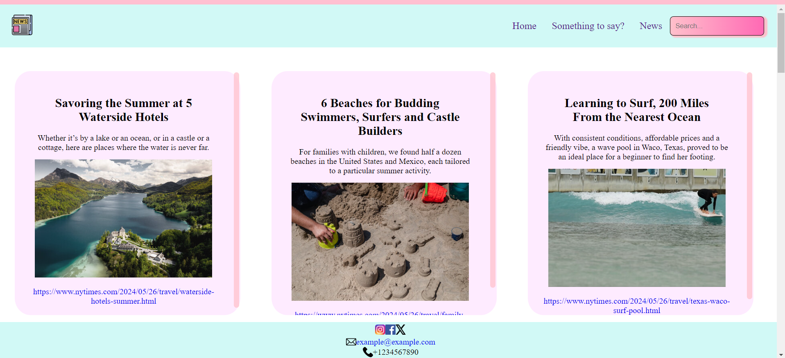
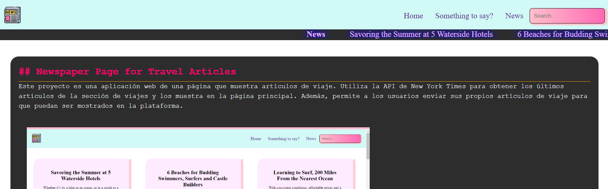

# Newspaper Page for Travel Articles

Este proyecto es una aplicación web de una página que muestra artículos de viaje. Utiliza la API de New York Times para obtener los últimos artículos de la sección de viajes y los muestra en la página principal. Además, permite a los usuarios enviar sus propios artículos de viaje para que puedan ser mostrados en la plataforma.

## Características

-   Muestra los últimos artículos de la sección de viajes obtenidos de la API de New York Times.
-   Permite a los usuarios enviar sus propios artículos de viaje para que sean mostrados en la plataforma.
-   Utiliza React y React Router para definir las rutas de la aplicación.
-   Utiliza el componente Link de React Router para la navegación entre páginas.
-   Establece un Global Context para hacer uso de ciertas variables de forma global en la aplicación.

## Instalación

1. Clona este repositorio a tu máquina local utilizando `git clone`.
2. Navega al directorio del proyecto y ejecuta `npm install` para instalar las dependencias.
3. Una vez completada la instalación, ejecuta `npm start` para iniciar la aplicación en tu navegador.

## Uso

-   Al abrir la aplicación, serás recibido con los últimos artículos de viaje de la API de New York Times.
-   Utiliza el menú de navegación para explorar diferentes secciones de artículos de viaje.
-   Haz clic en un artículo para ver más detalles.
-   Utiliza el formulario de envío de artículos para enviar tus propias historias de viaje.

## Tecnologías Utilizadas

-   React
-   React Router

## Autor

Daniella Barraza - [Perfil de GitHub](https://github.com/DaniellaBarraza125)
